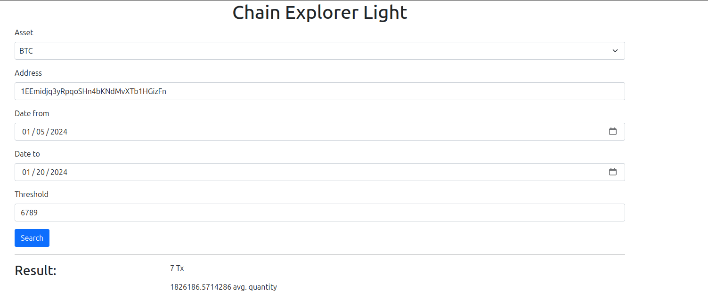
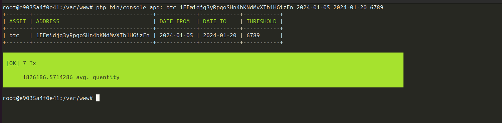

# Chain Explorer Light

## Installation
First you need to build the PHP image and start containers using  `docker compose up -d`.

Once the containers are running, please log into the app container and run the DB migration
*  `docker exec -it app bash`
*  `php bin/console doctrine:migrations:migrate`

## Usage
You can use it via the browser or via the terminal 

PS: I use the free plan, if you want to avoid the rate limit please adjust the env variable `API_TOKEN`